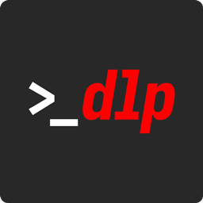

<div align="center">
  
  <h1>yt-dlp GUI</h1>
  <p>Baixe vídeos e extraia áudio em uma interface simples, direto no seu computador.</p>
  <p><a href="https://github.com/lunionte/yt-dlp-ui-local/releases">Releases · Windows Portable</a> · <a href="#versão-web">Executar no navegador</a></p>
</div>

## O que é o projeto?

O yt-dlp GUI oferece uma interface visual para o [yt-dlp](https://github.com/yt-dlp/yt-dlp) e o [FFmpeg](https://ffmpeg.org/). Cole uma URL, escolha vídeo ou áudio, ajuste as opções e acompanhe o download.

A mesma interface está disponível no navegador e em um aplicativo Electron Portable para Windows. O processamento acontece localmente no seu computador.

## O que você pode fazer

- Baixar vídeos com seleção de resolução e container.
- Extrair áudio e escolher formato e qualidade.
- Acompanhar progresso, fila e etapas de processamento em tempo real.
- Definir a pasta de saída e a quantidade de downloads simultâneos.
- Cancelar tarefas e consultar logs e diagnósticos de erros.
- Baixar as mídias acessíveis de posts com vários vídeos.
- Selecionar autenticação opcional por navegador ou arquivo de cookies quando o site exigir sessão.

## Duas maneiras de usar

| Uso | Versão web | Electron Portable |
|---|---|---|
| Interface | Navegador | Janela própria no Windows |
| Execução | Node.js e ferramentas locais | Executável distribuído nas Releases |
| Ferramentas | yt-dlp e FFmpeg disponíveis no computador | yt-dlp e FFmpeg incluídos no pacote |
| Integração | Interface local | Bandeja, notificações e controles de janela |

### Electron Portable — Windows x64

1. Acesse a página de [Releases](https://github.com/lunionte/yt-dlp-ui-local/releases).
2. Baixe o arquivo `yt-dlp-GUI-Portable-<versão>.exe` da release desejada.
3. Execute o arquivo e escolha a pasta onde deseja salvar suas mídias.

O aplicativo é distribuído exclusivamente como Portable, sem instalador. Não é necessário instalar Node.js para usar o executável. As preferências ficam na pasta de dados do usuário do Windows, mesmo no modo Portable.

### Versão web

**Requisitos:** Node.js 22 ou superior, npm, yt-dlp e FFmpeg. FFprobe é opcional para diagnóstico. No Windows, coloque `yt-dlp.exe` e `ffmpeg.exe` na raiz do projeto; em Unix, as ferramentas também podem ser encontradas no PATH.

```bash
git clone https://github.com/lunionte/yt-dlp-ui-local.git
cd yt-dlp-ui-local
npm install
npm run build
npm start
```

Abra [http://127.0.0.1:3001](http://127.0.0.1:3001). O servidor atende apenas o computador local.

Para desenvolvimento, use `npm run dev` e abra [http://localhost:5173](http://localhost:5173).

## Sobre acesso aos sites

O suporte depende do yt-dlp e das regras de cada plataforma. Um vídeo público pode exigir uma sessão válida, sofrer limitação de requisições ou depender de uma atualização do extractor. Cookies não garantem que qualquer URL será baixável.

A autenticação é opcional e escolhida explicitamente nas configurações; a escolha vale para a sessão do aplicativo. Use apenas conteúdos que você tenha permissão para baixar.

## Desenvolvimento e distribuição

O projeto usa React, TypeScript, Express e Electron. Para trabalhar no desktop, mantenha `yt-dlp.exe` e `ffmpeg.exe` na raiz e execute:

```bash
npm install
npm --prefix desktop install
npm run desktop:dev
```

Para gerar o Portable localmente, use `npm run desktop:dist`. O comando oferece a alteração da versão e salva o executável em `release/`; não publica uma release automaticamente.

Consulte [agents.md](agents.md) para arquitetura, padrões de implementação, comportamento do versionamento e comandos de validação. Este README apresenta o projeto; as regras técnicas são mantidas nesse arquivo de contexto.
